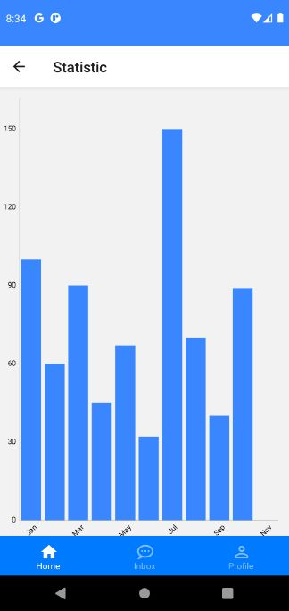

# Crowdfunding

*Crowdfunding* is a android application developed using React Native. Below is several screenshot of this application.

### Intro
 

### Registration
   

### Login
 

### Home
 

### Donation
   

### Payment
    

### History & Statistic
 

### Chat


### Profile
  

## Installation Instructions

### Manual/Development

1. Clone this repo.
2. In Terminal, run ```yarn install```.
3. To start listening react native ```yarn start```.
3. To start android emulator (assume Android Studio with AVD has installed) ```yarn start```.

## License

### Code

MIT License: http://mit-license.org/ or see [the `LICENSE` file](./LICENSE).

### Other images

[Creative Commons Attribution 3.0 Unported (CC BY 3.0) License](http://creativecommons.org/licenses/by/3.0/)

---
